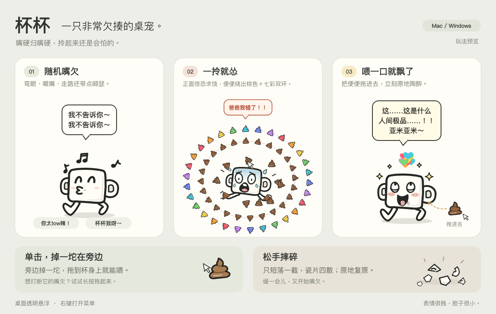

# 杯杯 · 桌面上最嘴硬的杯子

杯杯是一只本地运行的 Electron 桌宠。平时闭眼噘嘴、晃腿溜达，戳一下就贱笑，拎起来立刻认怂。它不需要账号或联网，适合挂在桌面上陪你摸鱼。



## 下载与运行

打开本仓库右侧的 **Releases**，在对应版本的 **Assets** 中下载完整运行包。仓库首次发布时，需要由维护者上传下列 ZIP；GitHub 自动生成的 `Source code` 压缩包仅包含源码，不能直接运行。

| 系统 | 下载文件 | 打开方式 |
| --- | --- | --- |
| Windows 10 / 11，64 位 Intel / AMD | `杯杯-Windows-x64.zip` | **全部解压**后双击 `Beibei.exe` |
| macOS 13 或更新版本，Apple 芯片 | `杯杯-Mac-Apple芯片.zip` | 解压后打开 `杯杯.app`，也可以拖入“应用程序” |

请保留解压目录中的所有文件，不要单独移动或转发 `Beibei.exe`。运行发布包不需要安装 Node.js 或 Python。Mac 发布包不适用于 Intel Mac。

## 怎么玩

- **单击杯杯**：正面贱笑，在旁边掉一坨便便。
- **拖便便投喂**：拖到杯身中央并松手，它会陶醉地吃掉。
- **拖动或长按杯杯**：惊恐乱蹬、求饶并持续排便；拎住约两秒，棕色和彩虹便便双环围着它公转。
- **松手**：便便向四周炸开，杯杯只短落一截，摔碎后在原处重新拼好。
- **移动鼠标**：偶尔嘴欠搭话，有 7 秒冷却。
- **右键杯杯**：打开菜单，可以静音、暂停溜达、找回杯杯、清理便便或退出。菜单栏 / 系统托盘的小杯子也能打开菜单。
- **Ctrl / ⌘ + Shift + B**：把杯杯叫回主屏幕。

声音优先使用系统本地中文语音，缺少中文声音时使用卡通音效；文字气泡始终保留。更多细节见[使用说明](docs/usage.txt)。

## 本地开发

准备 Node.js 22 或更新版本及 npm，然后在仓库目录运行：

```sh
cd app
npm install
npm start
```

`npm install` 会下载固定版本的 Electron；启动后的桌宠在本地工作。测试使用 Node.js 自带的测试运行器，在 `app` 目录执行：

```sh
npm test
```

目前包含 40 项自动测试，覆盖动画状态、拖拽、投喂、窗口坐标及输入处理。测试不需要启动 Electron。

## 仓库结构

```text
app/        应用源码、配置和图标
tests/     逻辑与输入测试
packaging/  Windows / Mac 打包脚本与运行时来源记录
docs/       使用说明与玩法预览
```

打包方法见 [packaging/README.txt](packaging/README.txt)。运行时缓存位于 `.cache/`，构建结果写入 `dist/`；它们均不提交到源码仓库。发布时将生成的 ZIP 和对应 `.sha256` 文件上传到 GitHub Release。

## 已知限制

- Windows 已完成打包、可执行文件和资源完整性检查，**尚未在 Windows 真机上验证**。
- Mac 已进行实际启动、动画截图和逻辑测试；当前发布包只面向 Apple 芯片。
- Windows 没有商业 Authenticode 签名；Mac 使用本地 ad-hoc 签名，未做 Apple Developer ID 签名或公证。首次打开时，系统可能要求来源确认。
- 杯杯只保存静音、允许溜达等本地偏好，不会自行添加开机启动。

## 许可

应用源码当前标记为 **UNLICENSED**，尚未指定开源许可证。

Electron、Chromium 和打包依赖遵循各自许可证；构建脚本会在运行包中保留 Electron / Chromium 的许可文件。
